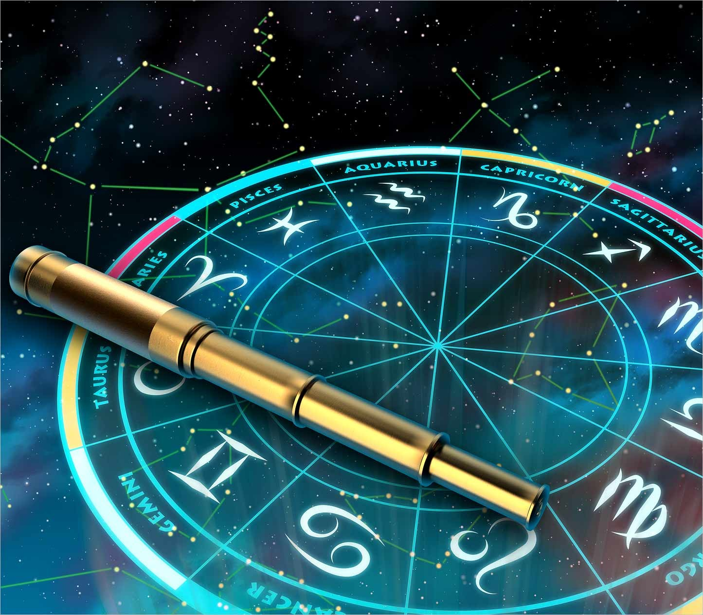

# Numerology App

Numerology app based on the birth path number! The birth path number is determined by doing a little bit of math magic with your date of birth. Your birthdate is reduced down to a single digit, 1-9. That number corresponds to a specific message about your path in life and place in the world. It’s real, I swear!

## How to get the birth path number:

In order to get your birth path number, you need to add up the individual digits of your birth date, and then keep adding them until you end up with a single digit.

For example, if your birthdate is May 20, 1965 (05201965), you add those numbers together like so:

0 + 5 + 2 + 0 + 1 + 9 + 6 + 5 = 28

Then add the numbers that make up the result together:

2 + 8 = 10

Since 10 is a two-digit number and we want a single-digit number, add the numbers that make up that result together again:

1 + 0 = 1

Your birth path number is 1!

<!-- ### Numerology Screenshot -->

